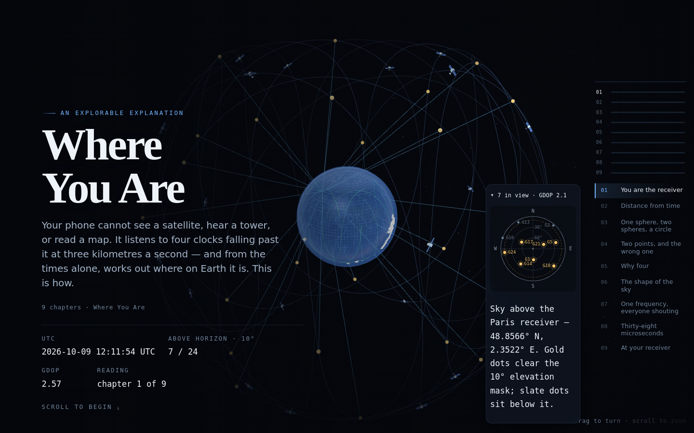

<div align="center">

# Where You Are

**An explorable explanation of GPS.**

Your phone cannot see a satellite, hear a tower, or read a map. It listens to four clocks
falling past it at three kilometres a second — and from the times alone, works out where on
Earth it is.

[](#architecture)
[](#run-it)
[](#is-the-maths-actually-real)
[](LICENSE)



</div>

## What this is

An **explorable explanation** — the form Bartosz Ciechanowski, Nicky Case and Distill.pub
made famous. Not an article with pictures: a page where you scroll through an argument and
the argument is *manipulable*. You drag a satellite's range and watch the solution circle
grow. You turn the relativistic correction off and watch the fix slide eleven kilometres a
day. You wreck the geometry of the sky and watch the accuracy collapse.

Nine chapters, from "a satellite is a lighthouse with a timestamp" to "why your phone's blue
dot is only honest to about five metres", with the real numbers the whole way through:
26 560 km orbits, 55° inclination, 299 792.458 km/s, 38 microseconds a day.

## Run it

No build step, no dependencies, no network calls at runtime.

```bash
cd gps-explained
python3 -m http.server 8130 --bind 127.0.0.1
# open http://localhost:8130
```

Any static server works — it is a folder of HTML, CSS and ES modules. (Serve it rather than
opening `index.html` from disk: ES modules need a real origin.)

## Is the maths actually real?

Yes, and it is checked in two places, both runnable:

```bash
node tools/verify-math.mjs     # 40 checks: orbits, WGS84, the solver, the geometry
node tools/verify-page.mjs     # drives a real headless Chromium over CDP
```

`verify-math.mjs` asserts the parts that are easy to fake:

| claim | how it is checked |
|---|---|
| orbital period is 11 h 58 m | 43 078 s from `n = √(μ/a³)`, against the real 43 082 s |
| inclination is 55° | maximum latitude reached by an unrotated orbit |
| WGS84 round trip | geodetic → ECEF → geodetic recovers lat/lon to 1e-9° |
| the position solver works | a simulated receiver with a 1 ms clock error is recovered to **under a micrometre** in 5 Gauss-Newton iterations |
| noise behaves honestly | 3 m of range error across 8 satellites → **4.5 m** typical position error (200 trials) |
| geometry matters | a deliberately bunched sky drives GDOP from **0.66 → 582** |
| sphere geometry is exact | two spheres' intersection circle matches the analytic solution; a third sphere's two candidate points are the truth and its exact mirror |

`verify-page.mjs` drives the browser: it boots the page, checks the canvas is not blank, runs
the **shipped** solver module in the browser (not a copy), scrolls every chapter to confirm it
activates and mounts geometry, moves a control and confirms the scene sees it, clicks a
"your turn" answer and confirms it unlocks the explanation, and checks for horizontal
overflow at 1440 / 900 / 390 px. It writes `docs/screens/*.png` as it goes.

## The chapters

| # | chapter | the ground it covers |
|---|---|---|
| 1 | You are the receiver | one-way messages, time → distance, why four satellites is the minimum |
| 2 | Distance from time | microseconds into metres; the slider that ruins your position |
| 3 | One sphere, two spheres, a circle | a range is a sphere; two ranges meet in a circle |
| 4 | Two points, and the wrong one | three spheres, two mirror answers, and how one is thrown away |
| 5 | Why four | the receiver's clock is the fourth unknown; the fourth satellite solves time |
| 6 | The shape of the sky | 24 satellites, elevation, GDOP, and why a street canyon ruins you |
| 7 | One frequency, everyone shouting | CDMA: 24 satellites on one carrier, pulled apart by correlation |
| 8 | Thirty-eight microseconds | two relativistic effects, net +38 µs/day, ≈ 11 km/day uncorrected |
| 9 | At your receiver | the honest error budget behind your phone's ±5 m dot |

## Architecture

```
index.html              one page: a sticky canvas + a scrollable column
css/base.css            tokens, layout, the sticky sky
css/explainer.css       chapter furniture: prose, controls, checks, readouts
js/main.js              boots the stage, builds the article, activates chapters
js/engine/mat4.js       column-major matrix and vector maths
js/engine/camera.js     orbit camera, pointer/wheel/keyboard input
js/engine/mesh.js       sphere, ring, graticule, coastline meshes
js/engine/shader.js     the GLSL this project is spelled in
js/engine/stage.js      WebGL2 stage: programs, buffers, three draw layers, frame loop
js/engine/vocab.js      the constants: μ, c, WGS84, 1 unit = 1000 km
js/gl/primitives.js     lines, points, meshes, halos, rings
js/gl/globe.js          the Earth: lit globe, coastlines, graticule, atmosphere
js/gl/constellation.js  the 24-slot constellation as a drawable object
js/gl/spheres.js        range spheres, intersection circles, candidate points
js/model/geo.js         WGS84: geodetic ↔ ECEF, ENU, elevation/azimuth
js/model/kepler.js      circular Keplerian orbits at the real radius and inclination
js/model/trilateration.js  the receiver's arithmetic: Gauss-Newton, DOP, sphere geometry
js/data/coastline.js    Natural Earth 110m land, rounded to 0.1° (public domain)
js/content/ch01..ch09.js  the chapters: data + a createScene(ctx) function
js/ui/               prose renderer, declarative controls, "your turn" checks
tools/verify-math.mjs   node: 40 assertions about the maths
tools/verify-page.mjs   chromium over CDP: 18 assertions about the page
docs/CONTRACT.md        the frozen interface every chapter is written against
```

Three ideas hold it together:

1. **Chapters never touch GL.** They compose actors out of a small library
   (`ctx.constellation()`, `ctx.spheres()`, `ctx.lines()`…), and the stage draws them in
   three fixed layers (`opaque`, `transparent`, `overlay`) so no chapter can break another's
   blending. Adding a chapter means adding one file.
2. **The picture and the number come from the same code.** The circle you see where two
   spheres meet *is* `sphereCircle()` — the same function whose radius the readout prints and
   whose value `verify-math.mjs` compares against the analytic solution. Nothing is drawn by
   hand.
3. **Everything is verifiable from a terminal.** A chapter that does not render, does not
   mount geometry, or throws is caught by `verify-page.mjs` before a human looks at it.

## Provenance and honesty

The orbital and geodetic numbers are the real ones (WGS84, μ = 398 600.4418 km³/s²,
a = 26 560 km, i = 55°). Orbits are modelled as **circular** — GPS satellites are very
nearly so (e < 0.02), and the contract says so plainly rather than pretending to a full
SGP4. Earth rotation uses the real rate (7.2921159e-5 rad/s) with an arbitrary epoch, so
the constellation is a plausible sky, not *tonight's* sky — chapter 9 says which error
sources are simplified and by how much. The coastline data is Natural Earth 110m land
polygons, public domain, rounded to 0.1° and embedded as a JS module so the page fetches
nothing at runtime.

## License

MIT — see [LICENSE](LICENSE). Natural Earth data is public domain.
